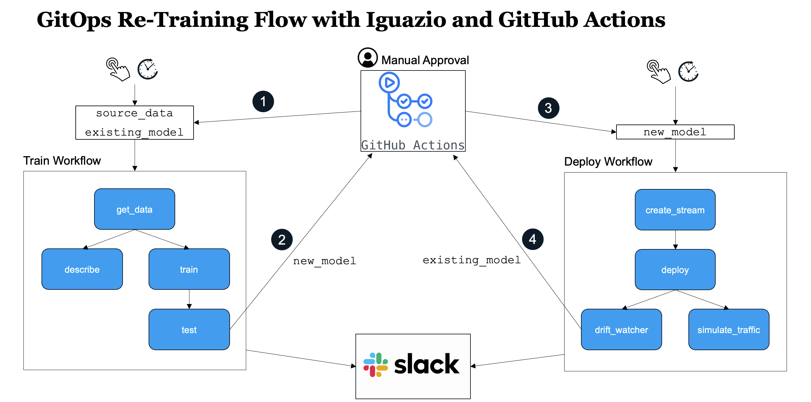

# ML Pipeline Automation and CI/CD Using GitHub Actions, Kubeflow and MLRun

Machine learning (ML) pipelines allow us to automate multi-stage workflow which comprise of 
data ingestion, data preparation, model training, validation and finally deployment.

Every time our code, data or parameters change we may want to re-evaluate our model accuracy and performance before we deploy.
This resembles the CI/CD practice for delivering code to production with the additional aspects of data and parameter/configuration versioning,
and may require more powerful resources (computation cluster, GPUs, data processing engines, etc.).

This template repo demonstrates how you can automate the development, testing, and deployment 
of machine learning projects using the following tools:

* [**GitHub actions**](https://github.com/features/actions) - used for code and metadata versioning, workflow triggering, and process tracking
* [**Kubeflow Pipelines**](https://www.kubeflow.org/docs/pipelines/overview/pipelines-overview/) - Used to execute ML pipeline steps on a (remote) Kubernetes cluster  
* [**MLRun**](https://github.com/mlrun/mlrun) - Used for end to end MLOps automation and tracking, [read more below](#mlrun-overview).

## How Does It Work?

This repo is representing an **mlrun project**, mlrun projects consists of **Functions** (code), **Artifacts** (data), **Workflows**, and **Parameters/secrets**. 
The [**project.yaml**](project.yaml) file list all of those elements.

Project elements can be linked (e.g. point to a library function which runs AutoML or data analysis, point to code/notebook files, point to external data objects, workflow files, etc.), 
or they can be embedded (e.g. store function code + configuration, workflow steps, etc.), in this example we show how to combine both.

In general, working with MLRun looks like the following:
 

 

This particular demo uses two workflows - one for training and one for deployment. They interact with one another via GitHub actions. The architecture looks like the following:
 

 

## Getting Started

See [main.ipynb](main.ipynb) for instructions on running the demo.

## What Is MLRun? 

MLRun is the first and currently only integrated open-source framework for end to end MLOps automation, it:
* Orchestrates job/pipeline from simple code or pre-baked functions (via Kubeflow and various k8s CRDs) 
* Runs, tracks and version projects comprising of experiments, jobs/functions, data, code, models and more.
* Provides an open marketplace for various ML, DL, Analytics, MLOps functions  
* Runs iterative AutoML, Hyper-param, or data analysis tasks on a distributed cluster  
* Automates deployment of models and real-time data processing functions using (Nuclio) real-time serverless engine 

Read more in [mlrun/mlrun](https://github.com/mlrun/mlrun)